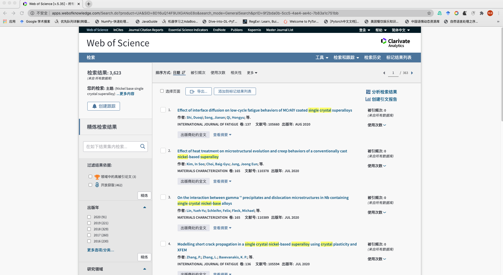
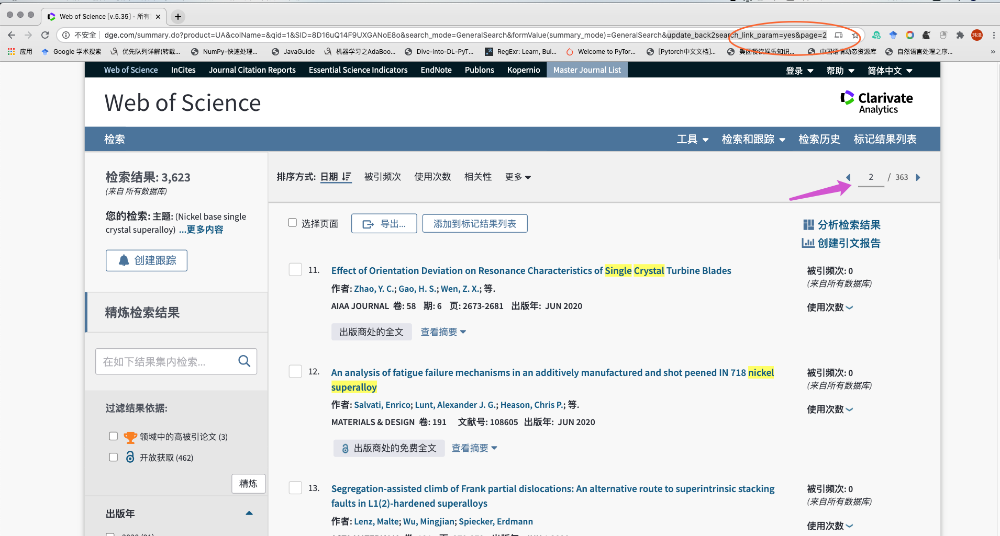
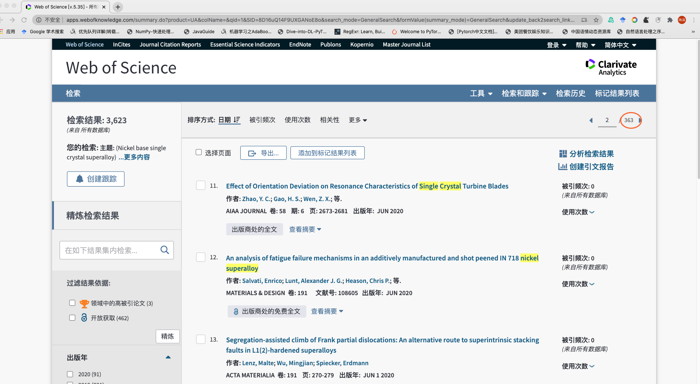

### 说明手册

#### 整个代码运行的前提是 能打开web of science并能展示出条件检索结果
#### 整个爬虫代码在Spider_by_VZ里面只有三个主要的py文件分别如下
* Main_Methods 里面包含了所有需要提取的信息抽取代码，无需关心
* main是使用的入口，main里面有三个参数需要指定，具体后面阐述。
* DownloadPdf 是 下载web of science 直接可获取的 文献pdf

#### main.py 参数说明：
总共有三个参数需要制定，我将分别用图片文字说明

1. 此时我们已经打开了web of science页面，但是这时候的url链接并不符合这个代码的要求（因为没有翻页参数）

2. 这时候，我们需要在下图箭头标志出随便输入一个页码，激活带有page参数的url。

3. 最终，我们可以根据该页面获得main函数里面的两个参数。

* url_root的设置 带有pages的url链接，但是不需要数字（比如上图里面的2删掉）注意：这个url_root里面是带有验证信息的，一般24小时，需要更换一次
* nums_page的设置为下图圆圈里面数字,也就是总页码

* filename 指定文献信息表格存的路径以及名字
    
    

### 环境 
* python 3.6
* 依赖的包
requests 
pandas  
beautifulsoup4 
tqdm